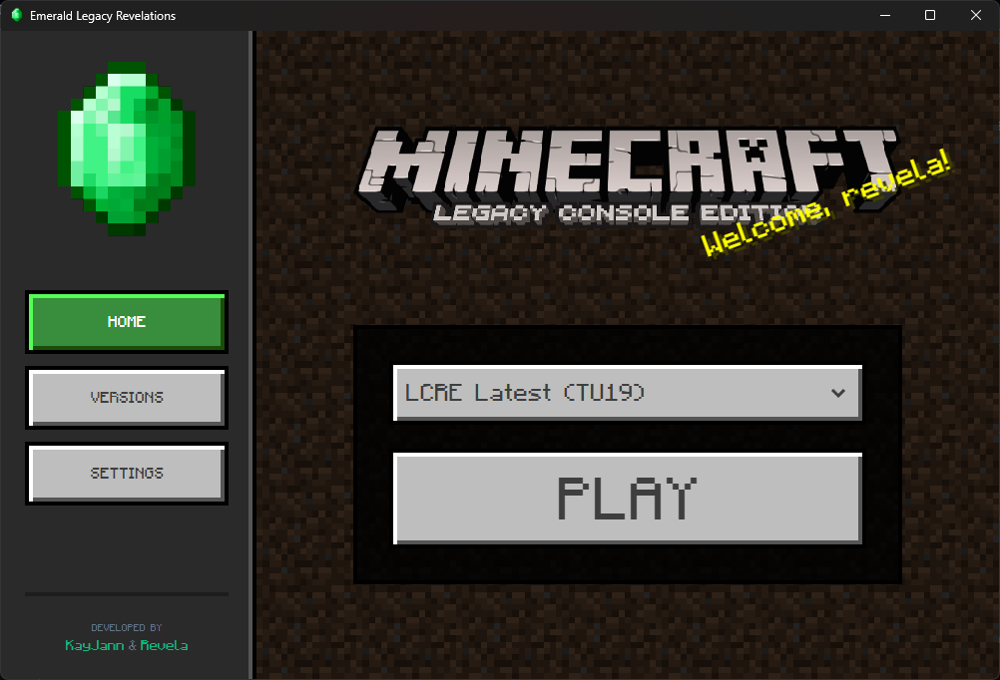

  
  <h1>Emerald Legacy Revelations Launcher</h1>
  
A modified version of Emerald Legacy Launcher for LCRE (Legacy Console Revelations Edition)

  
  

---

> [!IMPORTANT]
> **Emerald Legacy Revelations Launcher is currently in Alpha.**
> Expect bugs, frequent updates, and features that are still being polished work is done toward a stable release. This repo is a fork of `Emerald-Legacy-Launcher/Emerald-Legacy-Launcher`, adding support for Legacy Console Revelations Edition.

---

### PROJECT OVERVIEW
Emerald Legacy Revelations Launcher is a fork of Emerald Legacy Launcher, modified to support the LCRE (Legacy Console Revelations Edition) client with automatic update checking and version management. Built on the original work by KayJann.

**Philosophy:** For too long, the LCE scene has been fragmented across different, often resource-heavy launchers. Emerald was built to stop this fragmentation and centralize everything into a single, definitive hub. By avoiding bloated frameworks and utilizing a modern Rust/Tauri stack, we deliver a high-performance, cross-platform experience that uses only ~15MB of RAM, leaving all your PC's resources dedicated to the game itself.

---

### CORE FEATURES

<table width="100%" style="border-collapse: collapse;">
  <tr>
    <td style="padding: 20px; border: 1px solid #333;">
      <b>EASY SETUP</b> 
      An automated installation process for LCRE, TU19, and TU24, with more versions coming in future updates.
    </td>
    <td style="padding: 20px; border: 1px solid #333;">
      <b>RUST BACKEND</b> 
      A memory-safe backend that handles all file operations and game execution with minimal overhead.
    </td>
  </tr>
  <tr>
    <td style="padding: 20px; border: 1px solid #333;">
      <b>EASY CONFIGURATION</b> 
      An integrated settings menu to change your username and manage game parameters directly through the launcher.
    </td>
    <td style="padding: 20px; border: 1px solid #333;">
      <b>UPDATE CHECKING</b> 
      Automatically checks for new LCRE builds and notifies you when an update is available.
    </td>
  </tr>
</table>

---

### [DEVELOPMENT ROADMAP](https://github.com/orgs/Emerald-Legacy-Launcher/projects/2)
Click the heading above to track progress, view active tasks, and see upcoming launcher features.

---

> ### ACKNOWLEDGMENTS
> * **KayJann:** Original Emerald Legacy Launcher development.
> * **Revela:** Added support for Legacy Console Edition Revelations.
> * **4J Studios & Mojang:** Original creators of Legacy Console Edition.
> * **smartcmd & The LCE Community:** Research and foundations for Legacy Console Edition on PC.
> * **Tauri & Rust:** Core technologies.

---

***This project is licensed under the [GNU GPL v3 License](LICENSE)***
